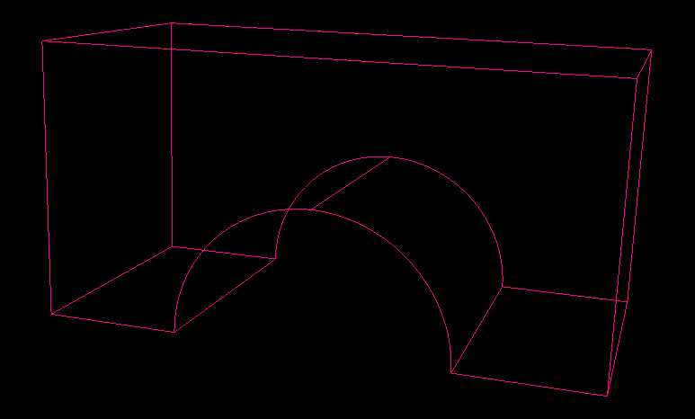
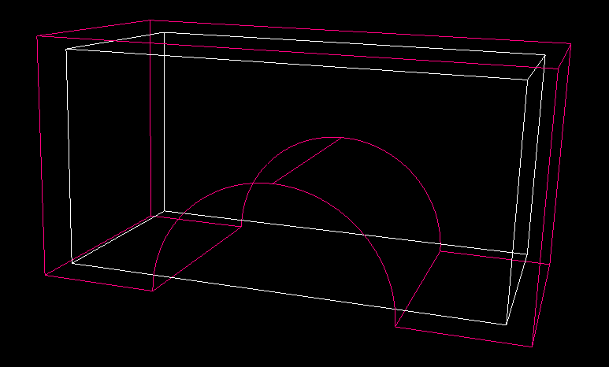
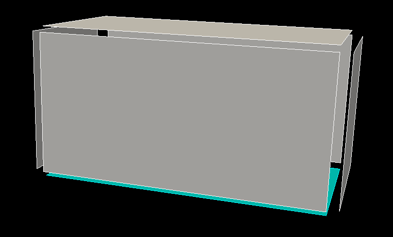
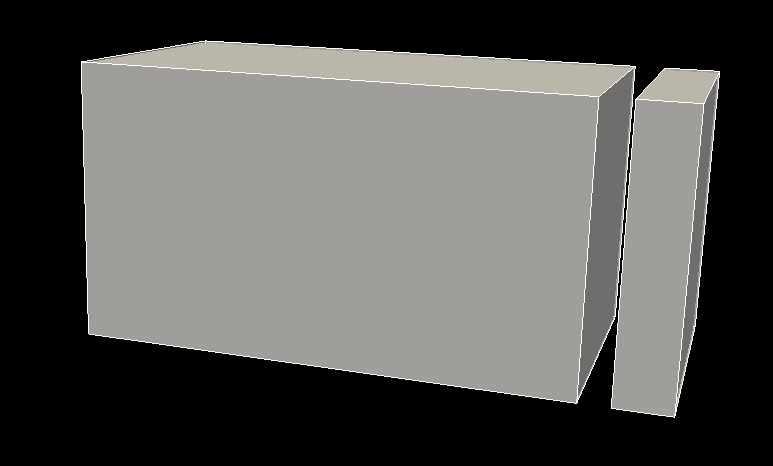
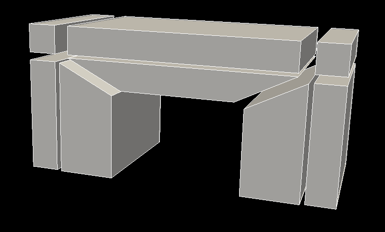
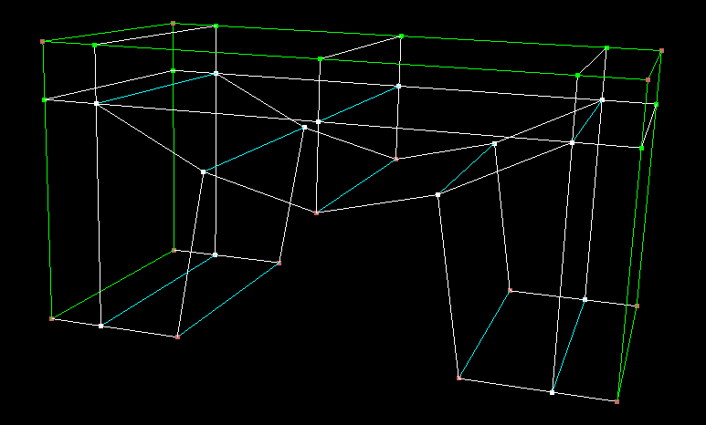
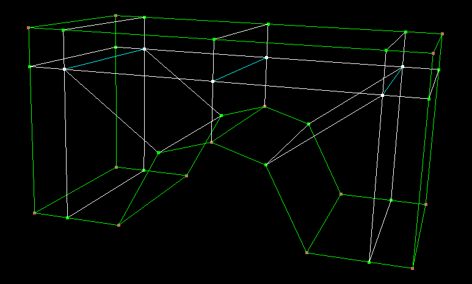
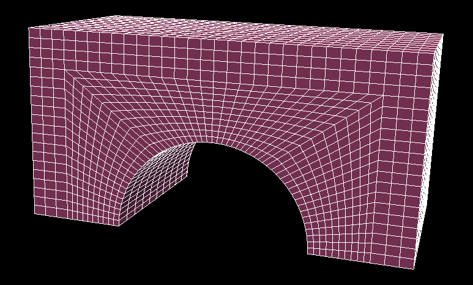

In this tutorial we will be creating the blocking and associate it to an imported geometruc model.

The geom model, in a STEP file format, can be found here . Choose a length unit before importing (session->unit length).
The full script is located here .

This is the geom model 

Create a free structured block associated to the volume (topo->block->create). A not free block cannot be created because the shape is too complex for magix3d to automatically associate the topo entities to the geometry. By choosing the volume the block initial position will be the bounding box of the volume.

Change the discretization of the edges (default is 10x10x10)

Associate the entites of the blocking to the geom model. Not all of them can be associated. You can associate the entities one by one or use "topo->vert/edge/face->assoc" and choose method "Vertices to geom entities". The same goes for the edges.

Do not forget to also do it for the faces

Split the block, here at 0.9

Proceed one the other side at 0.1

And at the top, this time split all the blocks at 0.8

Apply an ogrid pattern to the central block. Ensure that it imprints itself onto three of the faces,as shown here in the preview.

Once applied, this is what the blocking looks like, for both the blocks and then edges

 

Destroy the central bottom block.

And split the blocks at the top. It is necessary because at the moment we can assign an edge only to one single geometric entity, and the half circle at the bottom is composed of two curves.

Associate the topo vertices to geom points.

Associate the remaing vertices and topo edges to geom curves.

Also associate the last edges to surfaces.

Finally do the same for the faces

This is the resulting mesh.

