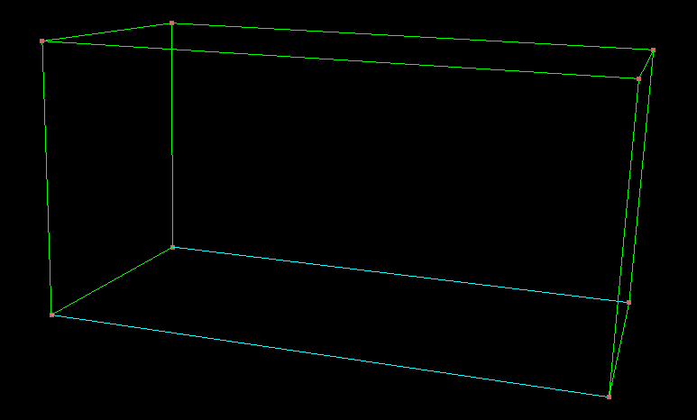
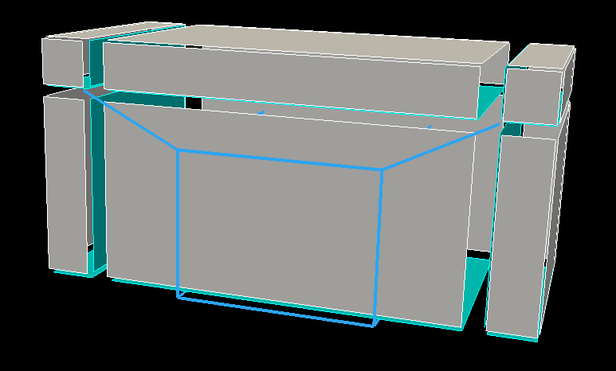
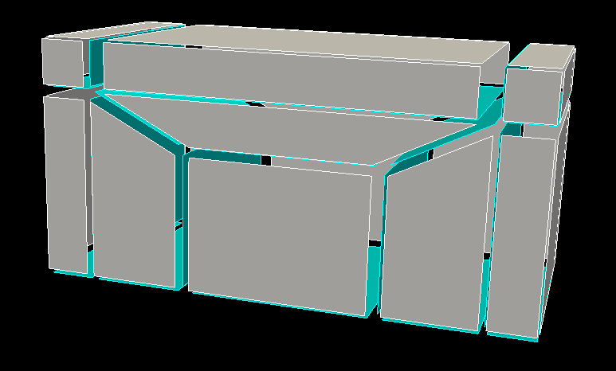
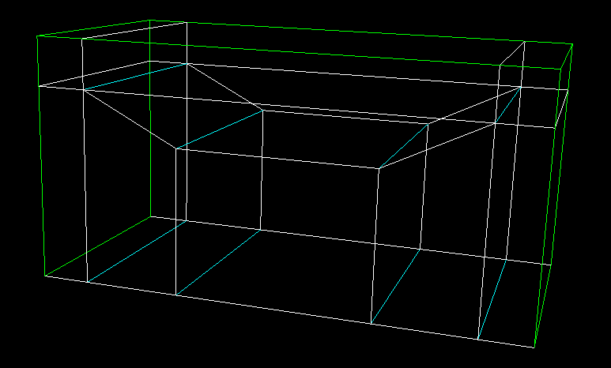
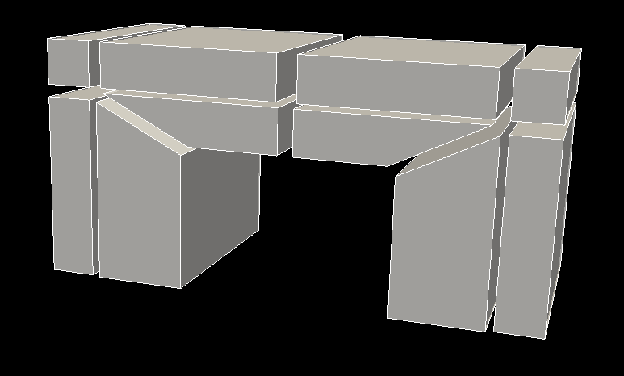
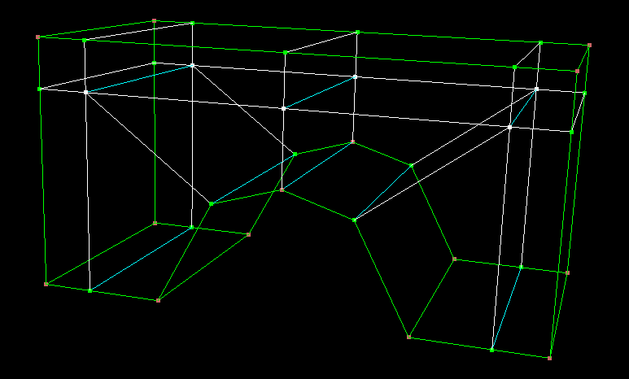

In this tutorial we will be creating the blocking and associate it to an imported geometruc model.

The geom model, in a STEP file format, can be found here . Choose a length unit before importing (session->unit length).
The full script is located here .

This is the geom model 

Create a free structured block. An associated block cannot be created because the shape is too complex for magix3d to automatically associate the topo entities to the geometry.

Associate the entites of the blocking to the geom model. Not all of them can be associated.

Do not forget to also do it for the faces

Apply an ogrid pattern to the block. Ensure that it imprints itself onto three of the faces,as shown here in the preview.

Once applied, this is what the blocking looks like, both faces and edges

 

Destroy the central bottom block.

And split the block at the top.

Associate the topo vertices to geom points.

Associate the remaing vertices and topo edges to geom curves.

Also associate the last edges to surfaces.

Finally do the same for the faces

This is the resulting mesh.

