In this tutorial we will be modelling and meshing a rook chess piece, starting from a 2D model that was pre-made.


The starting script (creating the 2D geometric model and blocking) can be found here . Run it before executing the following steps.
The full script is located here .

Starting from the 2D geom/topo 

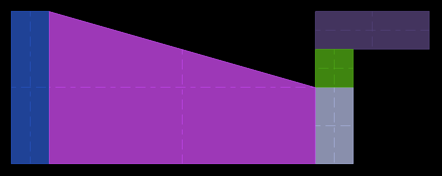

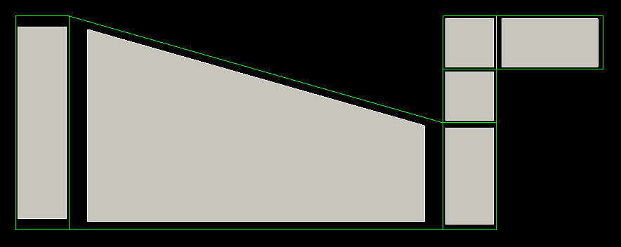

Split the faces in order to introduce a line of free (here meaning not associated to geom curves) edges next to the edges on the X-axis.

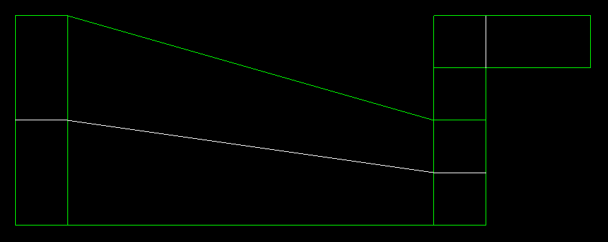

Now automatically generate the 3D geometry and topology using the makeBlocksByRevol command (found in the topo->block menu) and selecting one of those edges as a base for the ogrid pattern.

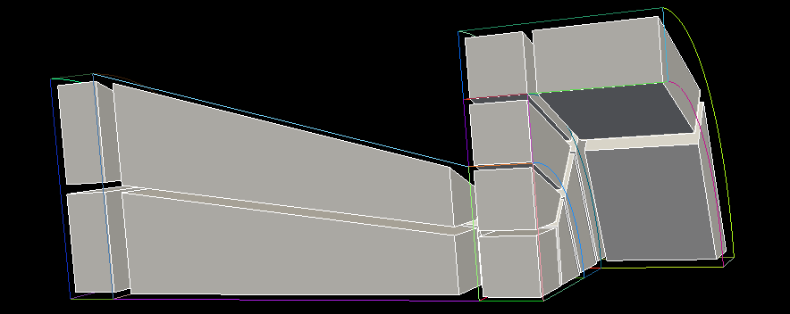


Now a little bit of geometric modelling is necessary in order to make the indentations at the top of the rook chess piece. The following commands create a portion of a cylinder, position it and cut it out of the top of the piece.
```python
# Création du cylindre Vol0005
ctx.getGeomManager().newCylinder (Mgx3D.Point(5, 0, 0), 3, Mgx3D.Vector(1, 0, 0), 4.500000e+01)
# Rotation de Vol0005 suivant  [  [ 0, 0, 0] ,  [ 1, 0, 0] , 315] 
ctx.getGeomManager().rotate(["Vol0005"], Mgx3D.RotX(315))
# Différences entre géométries avec plusieurs entités à couper
ctx.getGeomManager().cut(["Vol0004"], ["Vol0005"])
```

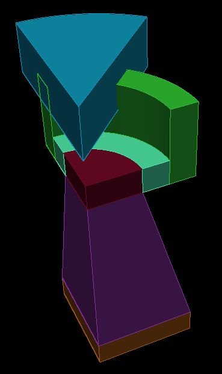

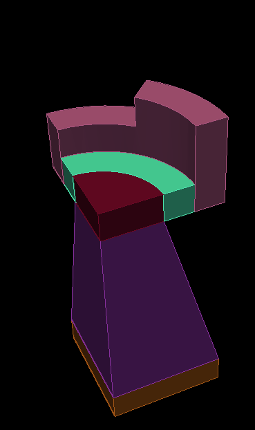

The geometric entities have been modified, and the same should be done for the blocking entities.

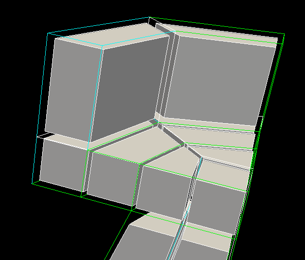

Split the blocks and destroy one of them.

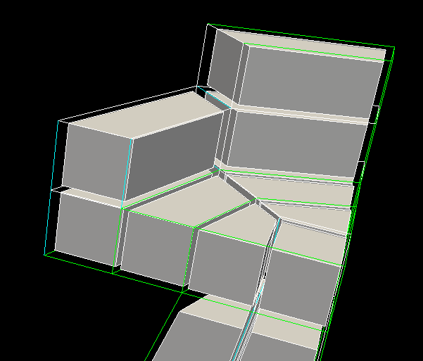

And re-associate the blocking entities, starting from nodes, edges and faces.

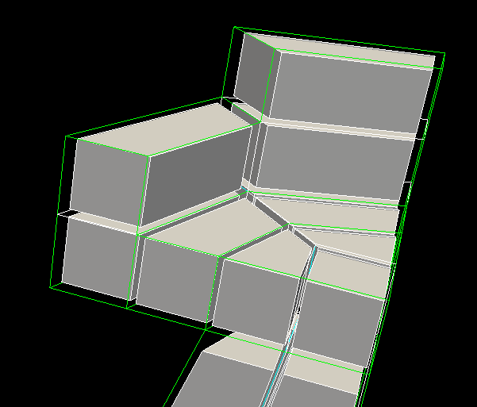

Here we rotate (do not forget to check the dupplicate the geometry and copy the topology optios) the whole model.

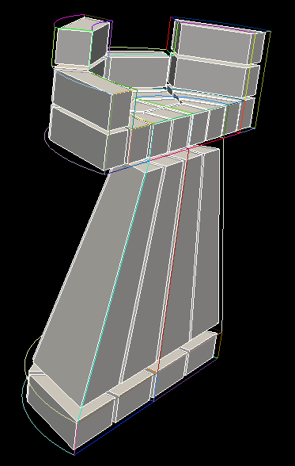

Simply do the same two additional times to complete the whole model. You can see that between the copied parts the topo faces appear in double. It is because the while the geometric model was copied and placed at the right spot, the geom surfaces and topo faces are simply in contact; they were not glued nor fused. At your convenience you can fuse the topo faces, or choose to use the glue operation on all the volumes, as this operation also tries to fuse faces when possible. 

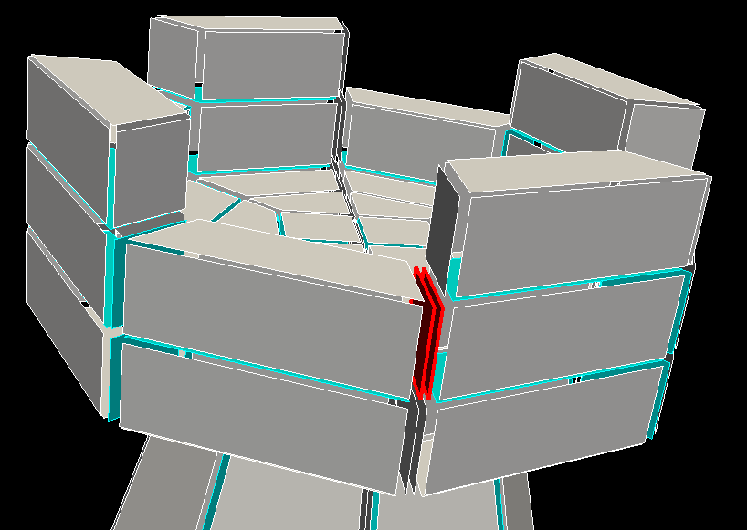

This is the resulting mesh.

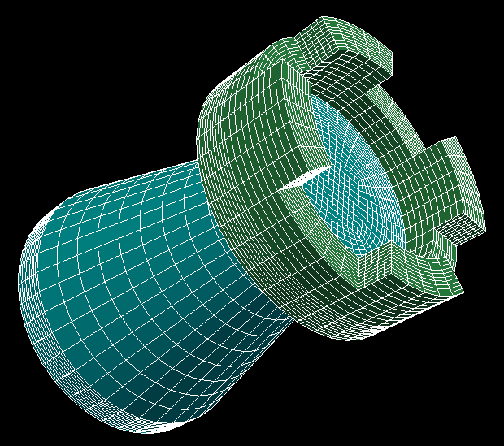

Exploring the sheets of hexahedra is a way to check that the fusion between faces that used to delimit the four quarters of the domain went well. If a junction was missed the sheet could end up not propagating across the whole domain. Another debug tip is to use the exterior face selection tool. If faces that seem to be internal are highlighted it means that some fusion were not done.

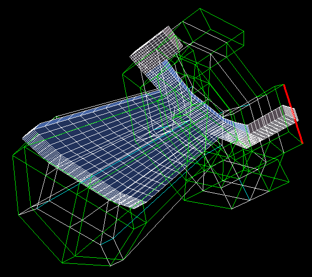

